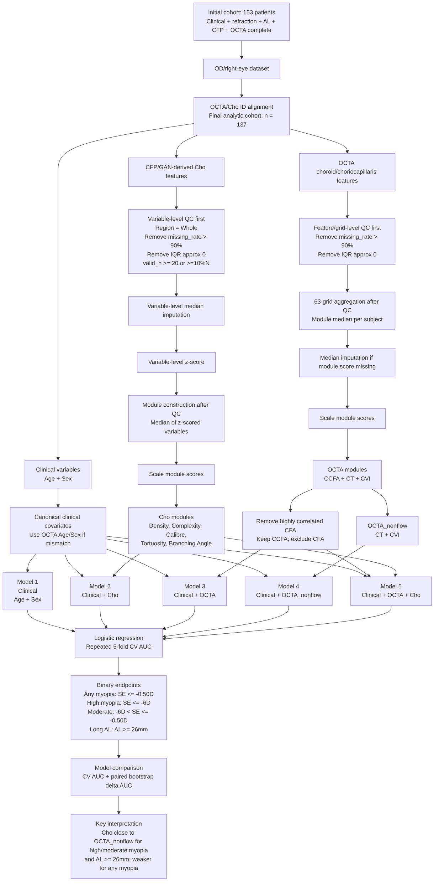

# Adjusted Workflow Diagram: QC Before Module Construction

```mermaid
flowchart TD
    A["Initial cohort: 153 patients<br/>Clinical + refraction + AL + CFP + OCTA complete"] --> B["OD/right-eye dataset"]
    B --> C["OCTA/Cho ID alignment<br/>Final analytic cohort: n = 137"]

    C --> D1["OCTA choroid/choriocapillaris features"]
    C --> D2["CFP/GAN-derived Cho features"]
    C --> D3["Clinical variables<br/>Age + Sex"]

    D1 --> E1["Feature/grid-level QC first<br/>Remove missing_rate > 90%<br/>Remove IQR approx 0"]
    E1 --> F1["63-grid aggregation after QC<br/>Module median per subject"]
    F1 --> G1["Median imputation if module score missing"]
    G1 --> H1["Scale module scores"]
    H1 --> I1["OCTA modules<br/>CCFA + CT + CVI"]
    I1 --> J1["Remove highly correlated CFA<br/>Keep CCFA; exclude CFA"]
    I1 --> J2["OCTA_nonflow<br/>CT + CVI"]

    D2 --> E2["Variable-level QC first<br/>Region = Whole<br/>Remove missing_rate > 90%<br/>Remove IQR approx 0<br/>valid_n >= 20 or >=10%N"]
    E2 --> F2["Variable-level median imputation"]
    F2 --> G2["Variable-level z-score"]
    G2 --> H2["Module construction after QC<br/>Median of z-scored variables"]
    H2 --> I2["Scale module scores"]
    I2 --> J3["Cho modules<br/>Density, Complexity, Calibre,<br/>Tortuosity, Branching Angle"]

    D3 --> K["Canonical clinical covariates<br/>Use OCTA Age/Sex if mismatch"]

    K --> M1["Model 1<br/>Clinical<br/>Age + Sex"]
    K --> M2["Model 2<br/>Clinical + Cho"]
    J3 --> M2
    K --> M3["Model 3<br/>Clinical + OCTA"]
    J1 --> M3
    K --> M4["Model 4<br/>Clinical + OCTA_nonflow"]
    J2 --> M4
    K --> M5["Model 5<br/>Clinical + OCTA + Cho"]
    J1 --> M5
    J3 --> M5

    M1 --> N["Logistic regression<br/>Repeated 5-fold CV AUC"]
    M2 --> N
    M3 --> N
    M4 --> N
    M5 --> N

    N --> O["Binary endpoints<br/>Any myopia: SE <= -0.50D<br/>High myopia: SE <= -6D<br/>Moderate: -6D < SE <= -0.50D<br/>Long AL: AL >= 26mm"]
    O --> P["Model comparison<br/>CV AUC + paired bootstrap delta AUC"]
    P --> Q["Key interpretation<br/>Cho close to OCTA_nonflow for high/moderate myopia<br/>and AL >= 26mm; weaker for any myopia"]
```

